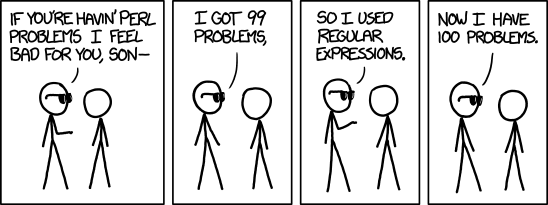

<div style="text-align: justify">

```{r setup, include=FALSE}
knitr::opts_chunk$set(
	echo = FALSE,
	message = FALSE,
	warning = FALSE,
	error = TRUE

)
```


_En mi caso, he decidido realizar esta práctica de forma divertida, para enfocar los conocimientos adquiridos en mi vida diaria._

___

# **🦖[REGEX]**
___

Las expresiones regulares **(Regex)**, son patrones de coincidencia utilizados para encontrar una determinada combinación de caracteres dentro de una cadena de texto. Estos patrones pueden usarse para _comparar, extraer, remplazar o dividir_ segmentos de un texto particular, en otra cadena, texto largo o documento.

Al respecto, [**John D. Cook**](https://www.johndcook.com/blog/services-2/) consultor en matemáticas aplicadas, estadística y privacidad de data, 
menciona en su cuenta de twitter, destinada a expresiones regulares [(RegexTip)](https://twitter.com/RegexTip), cuatro tips importantes que le ayudaron a comprender de ellas mientras aprendía:

- Las expresiones regulares no son insignificantes, no son triviales, pero tampoco son tan difíciles. Solo toman un poco de estudio.
- Las expresiones regulares no son comodines de líneas de comando, contienen algunos de los mismos símbolos, pero no significan lo mismo. Hay que aislar este pensamiento porque suele causar confusión.
- Las expresiones regulares son un pequeño lenguaje de programación, generalmente están contenidas dentro de otro lenguaje de programación, hay que pensar en ellas, como pequeños fragmentos de un idioma extranjero, como una cita en francés dentro de la prosa inglesa. Por ende, no hay que esperar que las reglas del idioma externo tengan ninguna relación con las reglas internas.
- Los _Character clases_ ([]), son un pequeño sub-lenguaje dentro de las expresiones regulares. Una vez que te das cuenta de eso y no esperas que se apliquen las reglas para las expresiones fuera de ellos, pueden hacerse mas sencillos de entender.


<center>Problemas triviales!</center>

<center>

</center>
___

## Comparativa Enlaces de Interés

En la tabla a continuación, comparo dos páginas web dedicadas a enseñar de expresiones regulares, donde la columna de la izquierda representa mi fuente ganadora y la de la derecha.

<center>
Table: Comparativa páginas de _Regex_ 
<div style="text-align: center">
-| **Fuente Ganadora🏆** | **Fuente a Mejorar** | 
-| :-------------------:| :-------------------:|
🔗**Link** | [Regex One](https://regexone.com/) | [Regular Expressions.Info](https://www.regular-expressions.info/tutorial.html)
✅**Pros** | Permite aprender expresiones regulares de manera interactiva y simple, además de que trae tutoriales para lenguajes en específico. En esta pagina, definitivamente, se defiende que la practica hace al maestro...| Tiene una basta gama de tutoriales Regex, creo está bastante completa la información… (_no me atreví a seguir curioseando_)
‼️ **Cons** | No la conseguí antes. | Por temas de usabilidad, es imprescindible que el diseño esté siempre orientado y pensado por y para el usuario, en este sentido esta página tiene mucho aún por desarrollar.
☑️ **Score** | <font size="7">`10/10`| <font size="7">`5.4/10`</font>
</div>
</center>

___

Algunos Ejemplos de tweets contenidos en la cuenta de   [(RegexTip)](https://twitter.com/RegexTip):

___

<center><blockquote class="twitter-tweet"><p lang="en" dir="ltr"><font size="2.5">Reminder: * means zero or more, + means one or more, ? means zero or one.</p>&mdash; Regular Expression (@RegexTip) <a href="https://twitter.com/RegexTip/status/1192109981027504129?ref_src=twsrc%5Etfw">November 6, 2019</font></a></blockquote> <script async src="https://platform.twitter.com/widgets.js" charset="utf-8"></script>

<blockquote class="twitter-tweet"><p lang="tl" dir="ltr"><font size="2.5">Regex crossword <a href="https://t.co/Uuj2gjYlWM">https://t.co/Uuj2gjYlWM</a></p>&mdash; Regular Expression (@RegexTip)</font> <a href="https://twitter.com/RegexTip/status/1168902012941078528?ref_src=twsrc%5Etfw">September 3, 2019</a></blockquote> <script async src="https://platform.twitter.com/widgets.js" charset="utf-8"></script>


<blockquote class="twitter-tweet"><p lang="en" dir="ltr"> <font size="2.5">Outside of a character class, the only special characters in regular expressions are [\^$.|?*+() Most characters are treated literally.</p>&mdash; Regular Expression (@RegexTip) </font><a href="https://twitter.com/RegexTip/status/1163828543463264261?ref_src=twsrc%5Etfw">August 20, 2019</a></blockquote> <script async src="https://platform.twitter.com/widgets.js" charset="utf-8"></script></center>


___

# **📓RMarkDown**

___

R Markdown es un formato que permite la fácil creación de documentos, presentaciones dinámicas e informes en R, utilizando de fondo un lenguaje llamado **Markdown** para enriquecer el informe final. 

Este permite incluir:

- Texto.
- ```Comandos de R.```
- Imágenes.
- Gráficos Interactivos.

Pero lo más importante es que permite que se reproduzca el análisis realizado y si se incorporan nuevos datos, los resultados se actualizarán.

Entre sus numerosas utilidades, se pueden mencionar las siguientes:

- **Documentos:**
  - HTML.
  - PDF.
  - Word.
  - Handouts.
  
- **Documentos Interactivos:**
  - Shiny.
  - Widges.
- **Dashboards**
- **Presentations**
- **Books**
- **Websites**
- *... y continúa la lista*

___

## Comparativa Enlaces de Interés

De igual forma que con el segmento anterior, en la tabla a continuación, comparo dos páginas web dedicadas a enseñar de RMarkdown, la columna de la izquierda continúa representando la ganadora.


<center>
Table: Comparativa páginas de _R Markdown_
<div style="text-align: center">
-| **Fuente Ganadora🏆** | **Fuente a Mejorar** | 
-| :-------------------:| :-------------------:|
🔗 **Link** | [R Markdown from R Studio](https://rmarkdown.rstudio.com/index.html) | [markdown.es](https://markdown.es/)
✅ **Pros** | Es la página más completa en contenido. Desde tutoriales básicos y explicitos, hasta formatos mas avanzados, esta fuente concatena la información necesaria para ser un experto en R Markdown.| Información  explicada en español, con enlaces externos útiles.
‼️ **Cons** |Puede llegar a parecer abrumadora la cantidad de contenido si no se ha investigado con paciencia como utilizarla. | El formato de la página no lo hace sencillo de entender, la publicidad distrae al usuario y no es intuitiva, este producto web no está bien construido.
☑️ **Score** | <font size="7">`9.5/10` | <font size="7">`4/10` </font>
</div>
</center>
___

# **⚽️Análisis Exploratorio FIFA 2019 **

En la presente sección, se realiza un breve análisis exploratorio de los datos contenidos en **FIFA 19 complete player Dataseet**, el cual expone los atributos detallados para cada jugador registrado en la ultima edición o base de datos FIFA19.


He utilizado el DS disponible en [GitHub](https://github.com/amanthedorkknight/fifa18-all-player-statistics/tree/master/2019), donde cada jugador se describe con mas de 80 atributos diferentes. Esta información se obtiene originalmente del website [SoFiFa](https://sofifa.com/).


## Librerías  de R Utilizadas

Para comenzar, es necesario leer (o instalar, en su defecto) las librerías CRAN contenidas a continuación, e importar la data, la cual extraigo directamente desde internet como un archivo csv.


```r
library("RCurl")
library("dplyr")
library("knitr")
library("kableExtra")
library("viridis")    
library("ggplot2")
library("gridExtra")
library("grid")
library("ggridges")
library("treemap")
library("tidyverse")
library("stringr")
library("ggforce")
library("DT")
library("RgoogleMaps")
library("ggmap")
library("rjson")
library("jsonlite")
library("leaflet")
```

La dimensión de la tabla original, es la siguiente:


```{r Leer la Data desde Internet y hacer limpieza de datos, echo=FALSE, warning=FALSE, paged.print=TRUE}
library("RCurl")
library("dplyr")


#LEER LA DATA 
fifa2019 <- read.csv("https://raw.githubusercontent.com/amanthedorkknight/fifa18-all-player-statistics/master/2019/data.csv")

FIFA19 <- select(fifa2019, ID, X, Name, Age, Nationality, Height, Weight, Overall, Club, Value, Wage, Position,Preferred.Foot,Body.Type)

#CAMBIAR LOS NOMBRES EN BLANCO POR _
names(FIFA19) <- gsub(' ', '_', names(FIFA19))

#CONVERTIR "WAGE" AND "VALUE" EN NUMEROS:
toNumberCurrency <- function(vector) {
  vector <- as.character(vector)
  vector <- gsub("(€|,)","", vector)
  result <- as.numeric(vector)
  
  k_positions <- grep("K", vector)
  result[k_positions] <- as.numeric(gsub("K","", vector[k_positions])) * 1000
  
  m_positions <- grep("M", vector)
  result[m_positions] <- as.numeric(gsub("M","", 
                                         vector[m_positions])) * 1000000
  
  return(result)
}
FIFA19$Wage <- toNumberCurrency(FIFA19$Wage) 
FIFA19$Value <- toNumberCurrency(FIFA19$Value)

#CAMBIAR LA ALTURA A CENTIMETROS
temp_1 <- as.numeric(substr(FIFA19$Height, 1, 1))*30.48
temp_2 <- as.numeric(substr(FIFA19$Height, 3, nchar(as.character(FIFA19$Height))))*2.54
FIFA19$Height <- round(temp_1 + temp_2, 1)

#CAMBIAR EL PESO A KG
FIFA19$Weight <- as.numeric(substr(FIFA19$Weight, 1, 3))*0.453592

#MODIFICAR LA POSICION DE LOS JUGADORES PARA QUE SEAN GENERICAS
x <- as.factor(FIFA19$Position)
levels(x) <- list(GK  = c("GK"), 
                  DEF = c("LWB", "LB", "CB", "RB", "RWB", "LCB", "RCB","RB"),
                  MID = c("LW","LM","CDM","CM","CAM","RM","RW","CAM", "LAM", "RAM", "LDM","RCM","LCM","LCM","RDM"), 
                  FWD = c('RF', 'ST', 'LF', 'RS', 'RW', 'LS', 'LW', 'CF'))

FIFA19 <- mutate(FIFA19, Position = x)

dim(fifa2019)

```

Por dicho motivo, se hizo necesario el filtrado de la misma.

___

## Visualización de la Tabla Estudio

La columna de Posición, tiene por default muchos valores diferentes (*Position Levels: 28*) correspondientes a todas las posibles posiciones de un jugador en la cancha, para este estudio agrupo dichos valores en 4 grandes familias:

- FWD (Delanteros)
- DEF (Defensas)
- MID (Mediocampos)
- GK (Guardametas)


**FIFA 2019 DataSet Filtered**

___

```{r Visualización de la tabla estudio}
#if (!require("DT")) install.packages('DT')

library(knitr)
library(kableExtra)
library(DT)
library(dplyr)

FIFA19[1:100,c(3:9,12)] %>%
  DT::datatable() %>%
  DT::formatStyle(columns = c(1:13), fontSize = '80%',class = 'compact')

```

___

## Análisis Exploratorio de la Data
En el tratado de estos datos, podemos apreciar lo siguiente:

### Distribución de Variables Físicas
Las líneas punteadas en cada histograma, representan el promedio para cada muestra.

```{r message = F, warning = F, fig.width = 10, fig.align = 'center'}
#summary de la tabla FIFA2019
summary_data <- function(FIFA2019) {
  paste('Mean:', round(mean(FIFA2019, na.rm = T), 2), 
        '\nMedian:', round(median(FIFA2019, na.rm = T), 2), 
        '\nMax:', round(max(FIFA2019, na.rm = T), 2), 
        '\nMin:', round(min(FIFA2019, na.rm = T), 2))
}

summary_data_euro <- function(FIFA2019) {
  paste('Mean:', dollar(round(mean(FIFA2019, na.rm = T), 2), prefix = '€'), 
        '\nMedian:', dollar(round(median(FIFA2019, na.rm = T), 2), prefix = '€'), 
        '\nMax:', dollar(round(max(FIFA2019, na.rm = T), 2), prefix = '€'), 
        '\nMin:', dollar(round(min(FIFA2019, na.rm = T), 2), prefix = '€'))
}


#EDADES
library("ggplot2")
library("viridis")    


p1 <- FIFA19 %>% 
  ggplot(aes(Age)) + 
  theme(legend.position = "NA") + 
  geom_histogram(col="gray", aes(fill = ..count..),bins = 30) +
  geom_vline(aes(xintercept = mean(Age)), linetype = 'dashed', colour = 'black') + 
  ggtitle("Distribucion de edades de Jugadores") +
  scale_fill_viridis(option="D") +
  labs(subtitle = summary_data(FIFA19$Age),x="Edades")
p1
 

# ALTURA
p2 <- FIFA19 %>% 
  ggplot(aes(Height)) + 
  theme(legend.position = "NA") + 
  geom_histogram(col="gray", aes(fill = ..count..),bins = 30) +
  geom_vline(aes(xintercept = mean(Height, na.rm = T)), linetype = 'dashed', colour = 'black') + 
  ggtitle("Distribucion de Altura  Jugadores") +
  scale_fill_viridis(option="D") +
  labs(subtitle = summary_data(FIFA19$Height), x="Altura") 
  
p2

# Weight
p3 <- FIFA19 %>% 
  ggplot(aes(Weight)) + 
  theme(legend.position = "NA") + 
  geom_histogram(col="gray", aes(fill = ..count..),bins = 30) +
  geom_vline(aes(xintercept = mean(Weight, na.rm = T)), linetype = 'dashed', colour = 'black') + 
  ggtitle("Distribucion de Pesos de Jugadores") +
  scale_fill_viridis(option="D") +
  labs(subtitle = summary_data(FIFA19$Weight), x="Peso")  
p3


# Pie Favorito
temp <- FIFA19$Preferred.Foot %>% 
  table(exclude = NULL) %>% 
  as.data.frame() %>% 
  mutate(Percent = round(Freq/nrow(FIFA19)*100, 2))

p4 <- FIFA19 %>% 
  ggplot(aes(Preferred.Foot)) + 
  geom_bar(colour = 'grey3', fill = 'turquoise4') + 
  geom_text(data = temp, aes(., Freq, label = paste0(Percent, '%')), family = 'serif', nudge_y = 1000) + 
  ggtitle("Distribucion de Uso de Pie")+
  labs(x="Pie Favorito")

p4

# Tipo de cuerpo
temp <- FIFA19$Body.Type %>% 
  table(exclude = NULL) %>% 
  as.data.frame() %>% 
  mutate(Percent = round(Freq/nrow(FIFA19)*100, 2)) %>% 
  arrange(-Freq) %>% 
  head(3)

p5 <- FIFA19 %>% 
  filter(Body.Type %in% temp$.) %>% 
  ggplot(aes(Body.Type)) + 
  geom_bar(colour = 'grey3', fill='turquoise4') + 
  geom_text(data = temp, aes(., Freq, label = paste0(Percent, '%')), family = 'serif', nudge_y = 600) + 
  guides(fill = F) + 
  ggtitle("Distribucion de Contexturas de cuerpos")+
  labs(x="Tipo de Cuerpo")

p5


```

Se puede apreciar en los histogramas, que la distribución de edades esta sesgada a la derecha, mientras que el resto de distribuciones son simétricas. 
La mayor parte de los jugadores utilizan preferiblemente el pie derecho.
El tipo de cuerpo con mayor porcentaje es el "normal", seguido por "delgado" y los jugadores "fornidos" son los menos dominantes.

- **Edad promedio:** 25.12 Años.
- **Altura Promedio:** 181.26 cms.
- **Peso Promedio:** 75.26 Kg.
- **Pie Favorito:** Derecho (76.61%)
- **Contextura de Cuerpos:** Normal (58.19%)


### Distribución de Posiciones Generales

```{r DISTRIBUCION DE POSICIONES, warning = F, fig.height = 7.5, fig.width = 10, fig.align = 'center'}
library(ggridges)

FIFA19 %>% 
  filter(!is.na(Position)) %>% 
  ggplot(aes(Overall, Position, fill = Position)) + 
  ggtitle("Distribucion de Posiciones Generales")+
  geom_density_ridges(alpha = 0.9) + 
  scale_fill_manual(values = c('#5ab4ac', '#8da0cb', '#8856a7', '#ffffb3')) + 
  labs(subtitle = paste('Median of Overall', 
                        '\n- FWD:', median(FIFA19$Overall[FIFA19$Position == 'FWD'], na.rm = T), 
                        '\n- MID:', median(FIFA19$Overall[FIFA19$Position == 'MID'], na.rm = T), 
                        '\n- DEF:', median(FIFA19$Overall[FIFA19$Position == 'DEF'], na.rm = T), 
                        '\n- GK:', median(FIFA19$Overall[FIFA19$Position == 'GK'], na.rm = T)))
```

Este es el resultado del plot de densidad por posición de jugador.
Los “forward”, “midfielder” y “defenders”, tienen formas simétricas, con valores de mediana casi iguales, lo que implica que (teóricamente) en "FIFA 19" estos están bien balanceados. Sin embargo, para los “Goalkeepers”, la distribución es diferente y la mediana menor a la de los demás. 


### Relación entre *Wage* vs *Value*

```{r Wage Vs Value , warning = F, fig.height = 7.5, fig.width = 10, fig.align = 'center'}
FIFA19 %>%
  ggplot(aes(x = Value, y = Wage)) +
  geom_point(alpha = 1/3) + 
  labs(title = "Correlacion entre Salario y Valor", x = "Valor en M euros") +
  scale_colour_manual(values = colors, name="Clarity")

```

La distribución de *Wage* y *Value* está sesgada, se puede ver que la mayoría de los puntos se concentran cerca del  cero. Sin embargo, a medida que aumenta el *Salario*, aumenta el *Valor*.

___


### Nacionalidad de los Jugadores (TREEMAP)

```{r Nacionalidd de los Jugadores con TreeMap , warning = F, fig.height = 7.5, fig.width = 10, fig.align = 'center'}
#if (!require("treemap")) install.packages('treemap')

library("treemap")
FIFA19 %>% group_by(Nationality) %>%
  summarize(count = n()) %>%
  treemap(index = "Nationality", vSize = "count",palette="YlGnBu", fontsize.labels = 9,title = "Nacionalidad de los Jugadores")


```

En el diagrama de árbol, se aprecia dominancia de jugadores europeos en los cuadrantes mas grandes.

___

## Jugador Favorito

En este segmento, se muestra a mi jugador preferido, el maravilloso:


<center><blockquote class="instagram-media" data-instgrm-captioned data-instgrm-permalink="https://www.instagram.com/p/Bz8jiUHo0wi/?utm_source=ig_embed&amp;utm_campaign=loading" data-instgrm-version="12" style=" background:#FFF; border:0; border-radius:3px; box-shadow:0 0 1px 0 rgba(0,0,0,0.5),0 1px 10px 0 rgba(0,0,0,0.15); margin: 1px; max-width:540px; min-width:326px; padding:0; width:99.375%; width:-webkit-calc(100% - 2px); width:calc(100% - 2px);"><div style="padding:16px;"> <a href="https://www.instagram.com/p/Bz8jiUHo0wi/?utm_source=ig_embed&amp;utm_campaign=loading" style=" background:#FFFFFF; line-height:0; padding:0 0; text-align:center; text-decoration:none; width:100%;" target="_blank"> <div style=" display: flex; flex-direction: row; align-items: center;"> <div style="background-color: #F4F4F4; border-radius: 50%; flex-grow: 0; height: 40px; margin-right: 14px; width: 40px;"></div> <div style="display: flex; flex-direction: column; flex-grow: 1; justify-content: center;"> <div style=" background-color: #F4F4F4; border-radius: 4px; flex-grow: 0; height: 14px; margin-bottom: 6px; width: 100px;"></div> <div style=" background-color: #F4F4F4; border-radius: 4px; flex-grow: 0; height: 14px; width: 60px;"></div></div></div><div style="padding: 19% 0;"></div> <div style="display:block; height:50px; margin:0 auto 12px; width:50px;"><svg width="50px" height="50px" viewBox="0 0 60 60" version="1.1" xmlns="https://www.w3.org/2000/svg" xmlns:xlink="https://www.w3.org/1999/xlink"><g stroke="none" stroke-width="1" fill="none" fill-rule="evenodd"><g transform="translate(-511.000000, -20.000000)" fill="#000000"><g><path d="M556.869,30.41 C554.814,30.41 553.148,32.076 553.148,34.131 C553.148,36.186 554.814,37.852 556.869,37.852 C558.924,37.852 560.59,36.186 560.59,34.131 C560.59,32.076 558.924,30.41 556.869,30.41 M541,60.657 C535.114,60.657 530.342,55.887 530.342,50 C530.342,44.114 535.114,39.342 541,39.342 C546.887,39.342 551.658,44.114 551.658,50 C551.658,55.887 546.887,60.657 541,60.657 M541,33.886 C532.1,33.886 524.886,41.1 524.886,50 C524.886,58.899 532.1,66.113 541,66.113 C549.9,66.113 557.115,58.899 557.115,50 C557.115,41.1 549.9,33.886 541,33.886 M565.378,62.101 C565.244,65.022 564.756,66.606 564.346,67.663 C563.803,69.06 563.154,70.057 562.106,71.106 C561.058,72.155 560.06,72.803 558.662,73.347 C557.607,73.757 556.021,74.244 553.102,74.378 C549.944,74.521 548.997,74.552 541,74.552 C533.003,74.552 532.056,74.521 528.898,74.378 C525.979,74.244 524.393,73.757 523.338,73.347 C521.94,72.803 520.942,72.155 519.894,71.106 C518.846,70.057 518.197,69.06 517.654,67.663 C517.244,66.606 516.755,65.022 516.623,62.101 C516.479,58.943 516.448,57.996 516.448,50 C516.448,42.003 516.479,41.056 516.623,37.899 C516.755,34.978 517.244,33.391 517.654,32.338 C518.197,30.938 518.846,29.942 519.894,28.894 C520.942,27.846 521.94,27.196 523.338,26.654 C524.393,26.244 525.979,25.756 528.898,25.623 C532.057,25.479 533.004,25.448 541,25.448 C548.997,25.448 549.943,25.479 553.102,25.623 C556.021,25.756 557.607,26.244 558.662,26.654 C560.06,27.196 561.058,27.846 562.106,28.894 C563.154,29.942 563.803,30.938 564.346,32.338 C564.756,33.391 565.244,34.978 565.378,37.899 C565.522,41.056 565.552,42.003 565.552,50 C565.552,57.996 565.522,58.943 565.378,62.101 M570.82,37.631 C570.674,34.438 570.167,32.258 569.425,30.349 C568.659,28.377 567.633,26.702 565.965,25.035 C564.297,23.368 562.623,22.342 560.652,21.575 C558.743,20.834 556.562,20.326 553.369,20.18 C550.169,20.033 549.148,20 541,20 C532.853,20 531.831,20.033 528.631,20.18 C525.438,20.326 523.257,20.834 521.349,21.575 C519.376,22.342 517.703,23.368 516.035,25.035 C514.368,26.702 513.342,28.377 512.574,30.349 C511.834,32.258 511.326,34.438 511.181,37.631 C511.035,40.831 511,41.851 511,50 C511,58.147 511.035,59.17 511.181,62.369 C511.326,65.562 511.834,67.743 512.574,69.651 C513.342,71.625 514.368,73.296 516.035,74.965 C517.703,76.634 519.376,77.658 521.349,78.425 C523.257,79.167 525.438,79.673 528.631,79.82 C531.831,79.965 532.853,80.001 541,80.001 C549.148,80.001 550.169,79.965 553.369,79.82 C556.562,79.673 558.743,79.167 560.652,78.425 C562.623,77.658 564.297,76.634 565.965,74.965 C567.633,73.296 568.659,71.625 569.425,69.651 C570.167,67.743 570.674,65.562 570.82,62.369 C570.966,59.17 571,58.147 571,50 C571,41.851 570.966,40.831 570.82,37.631"></path></g></g></g></svg></div><div style="padding-top: 8px;"> <div style=" color:#3897f0; font-family:Arial,sans-serif; font-size:14px; font-style:normal; font-weight:550; line-height:18px;"> Ver esta publicación en Instagram</div></div><div style="padding: 12.5% 0;"></div> <div style="display: flex; flex-direction: row; margin-bottom: 14px; align-items: center;"><div> <div style="background-color: #F4F4F4; border-radius: 50%; height: 12.5px; width: 12.5px; transform: translateX(0px) translateY(7px);"></div> <div style="background-color: #F4F4F4; height: 12.5px; transform: rotate(-45deg) translateX(3px) translateY(1px); width: 12.5px; flex-grow: 0; margin-right: 14px; margin-left: 2px;"></div> <div style="background-color: #F4F4F4; border-radius: 50%; height: 12.5px; width: 12.5px; transform: translateX(9px) translateY(-18px);"></div></div><div style="margin-left: 8px;"> <div style=" background-color: #F4F4F4; border-radius: 50%; flex-grow: 0; height: 20px; width: 20px;"></div> <div style=" width: 0; height: 0; border-top: 2px solid transparent; border-left: 6px solid #f4f4f4; border-bottom: 2px solid transparent; transform: translateX(16px) translateY(-4px) rotate(30deg)"></div></div><div style="margin-left: auto;"> <div style=" width: 0px; border-top: 8px solid #F4F4F4; border-right: 8px solid transparent; transform: translateY(16px);"></div> <div style=" background-color: #F4F4F4; flex-grow: 0; height: 12px; width: 16px; transform: translateY(-4px);"></div> <div style=" width: 0; height: 0; border-top: 8px solid #F4F4F4; border-left: 8px solid transparent; transform: translateY(-4px) translateX(8px);"></div></div></div></a> <p style=" margin:8px 0 0 0; padding:0 4px;"> <a href="https://www.instagram.com/p/Bz8jiUHo0wi/?utm_source=ig_embed&amp;utm_campaign=loading" style=" color:#000; font-family:Arial,sans-serif; font-size:14px; font-style:normal; font-weight:normal; line-height:17px; text-decoration:none; word-wrap:break-word;" target="_blank">Ce moment qui restera gravé dans nos mémoires ! 1 an déjà ! 🇫🇷 #ChampionDuMonde ⭐️⭐️</a></p> <p style=" color:#c9c8cd; font-family:Arial,sans-serif; font-size:14px; line-height:17px; margin-bottom:0; margin-top:8px; overflow:hidden; padding:8px 0 7px; text-align:center; text-overflow:ellipsis; white-space:nowrap;">Una publicación compartida de <a href="https://www.instagram.com/antogriezmann/?utm_source=ig_embed&amp;utm_campaign=loading" style=" color:#c9c8cd; font-family:Arial,sans-serif; font-size:14px; font-style:normal; font-weight:normal; line-height:17px;" target="_blank"> Antoine Griezmann</a> (@antogriezmann) el <time style=" font-family:Arial,sans-serif; font-size:14px; line-height:17px;" datetime="2019-07-15T17:42:18+00:00">15 Jul, 2019 a las 10:42 PDT</time></p></div></blockquote> <script async src="//www.instagram.com/embed.js"></script></center>


```{r Mi Jugador Favorito, echo=FALSE}
Griezmann <- FIFA19[FIFA19$Name == "A. Griezmann",]
(Griezmann)[3:8]
```


[**Antoine Griezmann**](https://es.wikipedia.org/wiki/Antoine_Griezmann), nace en Mâcon - Borgoña, es un futbolista francés que juega como delantero en el Fútbol Club Barcelona de la Primera División de España. Además, es internacional con la selección de fútbol de Francia y ganó la copa del mundo en Rusia 2018 con esta selección.


# 🇫🇷 **Visualización con Leaflet**

En este aparto, con la ayuda de la API de [**Google Cloud Platform**](https://console.developers.google.com/), he graficado las ubicaciones de Mâcon y del Camp Nou, actual club del jugador en cuestión.


```{r Leaflet, echo=FALSE, message=FALSE,  warning = F, fig.height = 6, fig.width = 8, fig.align = 'center'}

#DONDE NACIÓ Y DONDE JUEGA, librerias necesarias:
library(RgoogleMaps)
library(ggmap)
library(ggplot2)
library(rjson)
library(jsonlite)
library(leaflet)
library(RCurl)

#Autenticación clave de Google
my_key <- readLines("secrets/my_key-example.txt")
register_google(key = my_key)

#Geolocalización de puntos
macon <- geocode("Macon, Francia")
fcb <- geocode("Camp Nou")

#crear tabla  de puntos
coord <- as.data.frame(rbind(as.numeric(fcb),as.numeric(macon)))
colnames(coord) <- c("lon","lat")
coord$popup <- c("Where he is currently Playing","The birthplace of Griezmann")

#plotear Mapa de Leaftlet
map <- leaflet() %>%
  addTiles() %>% 
  addMarkers(data = coord, lng=~lon, lat=~lat,popup=~popup)
map

```


<font size="1"> *Give a man a program, frustrate him for a day.Teach a man to program, frustrate him for a lifetime.” ― Muhammad Waseem* </font>


</div>
